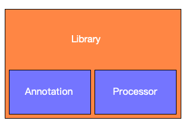
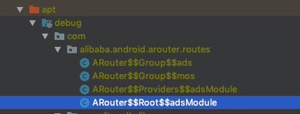

# 框架



主要分为三大块：

1、annotation模块，注解定义模块

2、processor模块，处理注解，编译时生成所需java文件

3、library模块，SQLiteOpenHelper的基础实现


### annotation模块


### processor模块

主要职能为继承`AbstractProcessor`，重写

```java
@Override
    public boolean process(Set<? extends TypeElement> set, RoundEnvironment roundEnvironment)
```

得到所有的注解

```JAVA
Set<? extends Element> elements = roundEnvironment.getElementsAnnotatedWith(DBColumn.class);
```

使用[javapoet](https://github.com/square/javapoet)生成`IDBProtocol`的相应实现的java文件

几个关键信息的获取：

##### 1、列名的确定

所有注解按类分组，

```java
VariableElement variableElement = (VariableElement) element;
            TypeElement classElement = (TypeElement) variableElement.getEnclosingElement();
            String fullClassName = classElement.getQualifiedName().toString();
```

通过

```java
DBColumn bindAnnotation = variableElement.getAnnotation(DBColumn.class);
```

获取注解实例，有别名优先使用别名，默认列名取key值。同理处理primaryKey

##### 2、列对应数据类型的确认

获取被注解Field的数据类型作相应转化

```
variableElement.asType()
```

##### 3、默认数据库更新的实现

大多数版本更新由表新增列引起，实现表列的自动新增能满足一般的业务需求，其他的可自行扩展。

表的列能自动新增，则要知道新增了哪些列。

已有列的获取：

```java
Cursor cursor = db.rawQuery("SELECT * FROM tableName", null);
String[] columnNames = cursor.getColumnNames();
```

现有列，通过DBColumn即可统计，知道多了哪些列，新增也就简单了：

```java
db.execSQL("ALTER TABLE tableName ADD COLUMN columnName columnType")
```

至此，make project后就能生成如下的`IDBProtocol`的实现类了

```jav
public class User$DBAdapter implements IDBProtocol<SQLiteDatabase, User> {
  private final String[] columns = {"num","name","id"};

  private final String tableName = "User";

  private SQLiteDatabase db;

  @Override
  public void init(SQLiteDatabase db) {
    this.db = db;
  }

  @Override
  public void create() {
    db.execSQL("CREATE TABLE IF NOT EXISTS User  (num TEXT,name TEXT,id INTEGER primary key)");
  }

  @Override
  public long insert(User model) {
    ContentValues values = model2Values(model);
    return insert(values);
  }

  public long insert(ContentValues values) {
    return db.insertOrThrow(tableName, null, values);
  }

 ....
}
```


类生成了，要怎么才能使用呢

国际惯例使用反射即可

```java
public <T> IDBProtocol getDBProtocol(Class<T> model){
        try {
            Class cursorClass = Class.forName(model.getName() + DBConstant.PROCESSOR_CLASS_SUFFIX);
            IDBProtocol protocol = (IDBProtocol) cursorClass.newInstance();
            protocol.init(getWritableDatabase());
            return protocol;
        } catch (ClassNotFoundException e) {
            e.printStackTrace();
        } catch (IllegalAccessException e) {
            e.printStackTrace();
        } catch (InstantiationException e) {
            e.printStackTrace();
        }
        return null;
    }
```

因为通过注解生成的类，都是`IDBProtocol`接口的实现，反射得到的实例强转化`IDBProtocol`就可以愉快的玩耍了


最后，`SQLiteOpenHelper`的`onCreate(SQLiteDatabase db)`、`onUpgrade(SQLiteDatabase db, int oldVersion, int newVersion)`需要知道建了哪些表

一个library的实现类，一个是业务层的需求（建表），信息怎么同步？

要求可以高点，业务层可能是多module解耦的，耦合问题怎么处理，

上文有提到，所有注解按类分组，一个model类即对应一个表，那就多生成java文件，定义需要建表的类名

```java
public class DBModelsConstant {
  public static final String[] models = {"com.arcsoft.processor.User","com.arcsoft.processor.Student"};
}
```

使用时，

```java
DBHelper.init(Context context, DBModelsConstant.models);
```

初始化到library中即可


##### 4.module相关

Bug:

理想很丰满，现实很骨感，apt的生成在各module中，对于没有module的项目，上述方案是可行。对于有module的项目就无能为力了，

参考ARouter的处理方案：

```java
Set<String> routerMap;

                // It will rebuild router map every times when debuggable.
                if (ARouter.debuggable() || PackageUtils.isNewVersion(context)) {
                    logger.info(TAG, "Run with debug mode or new install, rebuild router map.");
                    // These class was generated by arouter-compiler.
                    routerMap = ClassUtils.getFileNameByPackageName(mContext, ROUTE_ROOT_PAKCAGE);
                    if (!routerMap.isEmpty()) {
                        context.getSharedPreferences(AROUTER_SP_CACHE_KEY, Context.MODE_PRIVATE).edit().putStringSet(AROUTER_SP_KEY_MAP, routerMap).apply();
                    }

                    PackageUtils.updateVersion(context);    // Save new version name when router map update finishes.
                } else {
                    logger.info(TAG, "Load router map from cache.");
                    routerMap = new HashSet<>(context.getSharedPreferences(AROUTER_SP_CACHE_KEY, Context.MODE_PRIVATE).getStringSet(AROUTER_SP_KEY_MAP, new HashSet<String>()));
                }

```

使用`getFileNameByPackageName`遍历出所有的`DBModelsConstant`，

`Set<String> routerMap`马上就能发现有个深坑在等着我们，所以module中的`DBModelsConstant`的绝对路径都是相同，遍历的结果只剩app下的一个`DBModelsConstant`了

怎么解决，怎么区分不同module下的`DBModelsConstant`,看下ARouter的处理方案：



可以看到ARouter对于此类情况追加了moudleName后缀来个区分，moduleName如何获取呢，

```java
javaCompileOptions {
            annotationProcessorOptions {
                arguments = [AROUTER_MODULE_NAME: project.getName()]
                
            }
        }
```

`ProcessorOptions`中配置，在

```java
public interface ProcessingEnvironment {
    Map<String, String> getOptions();
}
```

中可以获取到对应options,

```java
public class DBProcessor extends AbstractProcessor{
  @Override
    public synchronized void init(ProcessingEnvironment processingEnv) {
      Map<String, String> options = processingEnv.getOptions();
    }
}
```

然后照着ARouter定义我们的KEY，

```java
javaCompileOptions {
            annotationProcessorOptions {
                arguments = [DBCOLUMN_MODULE_NAME: project.getName()]
            }
        }
```

就又可以愉快的玩耍了，

最后按ARouter的思路，通过sp给我们的`modelPaths`加上缓存


<link rel="stylesheet" href="https://cdn.jsdelivr.net/npm/gitalk@1/dist/gitalk.css">

<script src="https://cdn.jsdelivr.net/npm/gitalk@1/dist/gitalk.min.js"></script>
<div id="gitalk-container"></div>
<script>

var gitalk = new Gitalk({

"clientID": "f452f976595591ff3304",
"clientSecret": "230e5db6dfa1fdbe9a0e9987b58025092f938e62",
"repo": "doc",
"owner": "altair861",
"admin": ["altair861"],
"id": location.pathname,      
"distractionFreeMode": false  
});
gitalk.render("gitalk-container");

</script>