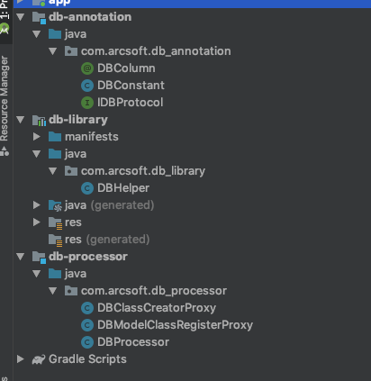

# jar包生成

[cydb-library](http://github.com/altair861/DBColumn.git)的项目结构为



分别将db-annotation,db-processor,db-library生成对应jar包，然后加上javapoet-1.11.1.jar包，将4个jar包合为一个即可，

`buildProcessor.sh`中有相应实现，主要为

```shell
function build_jar() {
    cd ${SDK_ROOT}
    echo ${SDK_ROOT}
    mkdir -p "tmp/"

    gradle db-processor:jar
    copy db-processor/build/libs/db-processor.jar tmp/
    copy db-processor/libs/javapoet-1.11.1.jar tmp/

    gradle db-annotation:jar
    copy db-annotation/build/libs/db-annotation.jar tmp/

    gradle db-library:build
    copy db-library/build/intermediates/intermediate-jars/debug/classes.jar tmp/db-library.jar

    copy build.xml tmp/
    cd tmp
    ant -buildfile build.xml

    cd -
    mkdir -p "db-library/build/outputs/libs/"
    copy tmp/cydb-library.jar db-library/build/outputs/libs/

    rm -rf tmp
}
```

执行`buildProcessor.sh`即可得到cydb-library.jar
<link rel="stylesheet" href="https://cdn.jsdelivr.net/npm/gitalk@1/dist/gitalk.css">

<script src="https://cdn.jsdelivr.net/npm/gitalk@1/dist/gitalk.min.js"></script>
<div id="gitalk-container"></div>
<script>

var gitalk = new Gitalk({

"clientID": "f452f976595591ff3304",
"clientSecret": "230e5db6dfa1fdbe9a0e9987b58025092f938e62",
"repo": "doc",
"owner": "altair861",
"admin": ["altair861"],
"id": location.pathname,      
"distractionFreeMode": false  
});
gitalk.render("gitalk-container");

</script>
<link rel="stylesheet" href="https://cdn.jsdelivr.net/npm/gitalk@1/dist/gitalk.css">

<script src="https://cdn.jsdelivr.net/npm/gitalk@1/dist/gitalk.min.js"></script>
<div id="gitalk-container"></div>
<script>

var gitalk = new Gitalk({

"clientID": "f452f976595591ff3304",
"clientSecret": "230e5db6dfa1fdbe9a0e9987b58025092f938e62",
"repo": "doc",
"owner": "altair861",
"admin": ["altair861"],
"id": location.pathname,      
"distractionFreeMode": false  
});
gitalk.render("gitalk-container");

</script>