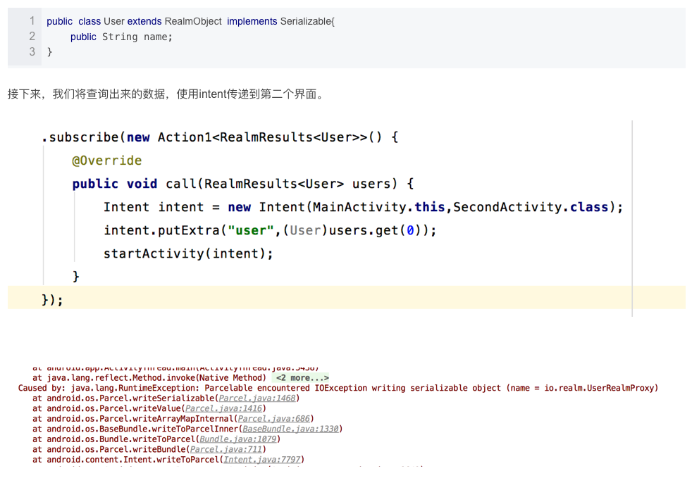

# 源起

### realm从入门到放弃

1、继承基类问题

```java
@RealmClass

public class User extends BaseModel implements RealmModel
```

很正常的一个需求，结果：

```java
错误: Realm model classes must either extend RealmObject or implement RealmModel to be considered a valid model class
```

2、表更新

```java
 class CustomMigration implements RealmMigration {
​     @Override
​     public void migrate(DynamicRealm realm, long oldVersion, long newVersion) {
​         RealmSchema schema = realm.getSchema();
​         if (oldVersion == 0 && newVersion == 1) {
​             RealmObjectSchema personSchema = schema.get("User");
​             //新增@Required的id
​             personSchema
​                     .addField("id", String.class, FieldAttribute.REQUIRED)
​                     .transform(new RealmObjectSchema.Function() {
​                         @Override
​                         public void apply(DynamicReal mObject obj) {
​                             obj.set("id", "1");//为id设置值
​                         }
​                     })
​                     .removeField("age");//移除age属性
​             oldVersion++;
​         }
​     }
}
```

3、查询结果，intent传值问题 



4、其他：线程；realmlist没有序列化；Realmlist`<T>`中，T必须继承RealmObject，RealmList`<String>`;自己维护primarykey


### 被迫营业

需要的功能：

1、数据库基础的增删改查

2、父类属性能为列

3、简洁